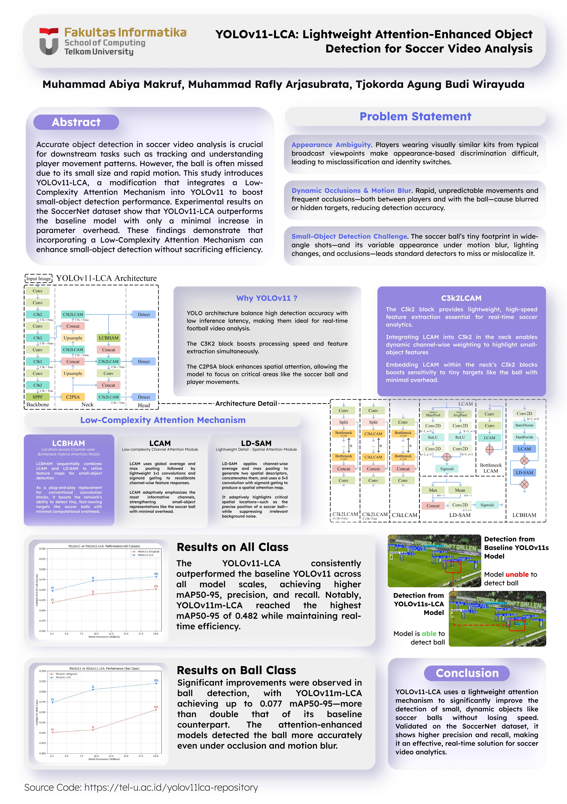

# ⚽ YOLOv11-LCA: Soccer Ball and Player Detection with Lightweight Attention

## 📌 Deskripsi
Proyek ini mengimplementasikan **YOLOv11-LCA**, yaitu pengembangan dari arsitektur YOLOv11 dengan integrasi **Low-Complexity Attention Module (LCAM)** untuk meningkatkan deteksi objek kecil, khususnya **bola sepak** dalam video siaran pertandingan. 🎯

Penelitian ini menunjukkan bahwa YOLOv11-LCA berhasil meningkatkan akurasi deteksi bola secara signifikan dibandingkan YOLOv11 original, dengan tetap mempertahankan efisiensi komputasi untuk keperluan real-time. Selain itu, proyek ini membandingkan performa berbagai skala model (nano, small, medium) dalam mendeteksi objek seperti **pemain**, **wasit**, **penjaga gawang**, dan **bola**. ⚽📊

---

## 📂 Dataset
Dataset yang digunakan dalam penelitian ini adalah:
- 🔗 **SoccerNet Tracking Dataset**  
  Sumber: [https://www.soccer-net.org/](https://www.soccer-net.org/)
- Subset: Match ID 4
- Frame rate: 25 fps
- Resolusi: 1920×1080
- Pembagian: 70% train, 10% validasi, 20% test

---

## 🎯 Target Publikasi
📚 Artikel ini ditujukan untuk publikasi pada jurnal ilmiah berikut:
🔗 **Lontar Komputer – Universitas Udayana**  
[https://ojs.unud.ac.id/index.php/lontar](https://ojs.unud.ac.id/index.php/lontar)

---

## 📁 Draft Jurnal
📄 Draf penulisan artikel ilmiah dapat dilihat di direktori:  
`Draft_Journal/`

---

## 🧠 Arsitektur Model
Model ini menggunakan backbone dari **YOLOv11** dengan integrasi LCAM dan LD-SAM pada bagian feature fusion (neck). Perubahan dilakukan pada blok C3k2 menjadi C3k2LCAM untuk meningkatkan sensitivitas terhadap fitur spasial objek kecil.

---

## 🔧 Konfigurasi Pelatihan
| Parameter        | Nilai        |
|------------------|--------------|
| Epoch            | 50           |
| Input Size       | 640x640      |
| Batch Size       | 16           |
| Optimizer        | Adam         |
| Learning Rate    | 0.01         |
| Momentum         | 0.937        |
| GPU              | RTX 3080     |
| Framework        | Ultralytics YOLOv11 v2.3.96 |

---

## 📊 Hasil Evaluasi

### 📌 Performa Deteksi Bola
| Model           | Precision | Recall | mAP@50 | mAP@50-95 |
|------------------|-----------|--------|--------|-----------|
| YOLOv11n         | 0.585     | 0.070  | 0.101  | 0.030     |
| **YOLOv11n-LCA** | 0.590     | 0.139  | 0.174  | 0.0577    |
| YOLOv11s         | 0.486     | 0.094  | 0.107  | 0.0337    |
| **YOLOv11s-LCA** | **0.613** | 0.151  | 0.205  | 0.0638    |
| YOLOv11m         | 0.558     | 0.137  | 0.156  | 0.0486    |
| **YOLOv11m-LCA** | 0.577     | **0.169** | **0.220** | **0.0773** |

> YOLOv11m-LCA menunjukkan hasil terbaik untuk deteksi bola di semua metrik kecuali precision, yang tertinggi pada YOLOv11s-LCA.s
> Source Model: https://drive.google.com/file/d/1uEbZsa9fk3FMpStNRsM330UjaFWGwzDU/view?usp=sharing

---

## 🧠 Kesimpulan
YOLOv11-LCA memberikan peningkatan akurasi deteksi signifikan terutama untuk objek kecil seperti bola, tanpa mengorbankan efisiensi.  
Dengan integrasi **LCAM**, model menjadi lebih sensitif terhadap fitur spasial kecil dan cocok digunakan untuk **real-time soccer analytics** seperti pelacakan bola, highlight otomatis, dan analisis taktik.  

**Model terbaik: YOLOv11m-LCA dengan input 640x640** untuk trade-off terbaik antara akurasi dan kecepatan deteksi.

---

## 👨‍💻 Authors
- **Muhammad Abiya Makruf**  
  🔗 [LinkedIn](https://www.linkedin.com/in/abiyamakruf/) | [GitHub](https://github.com/AbiyaMakruf)

- **Muhammad Rafly Arjasubrata**  
  🔗 [LinkedIn](https://www.linkedin.com/in/raflyarj/) | [GitHub](https://github.com/MuhRaflyArj)

---

🎯 **Proyek ini bertujuan untuk meningkatkan akurasi deteksi bola sepak dalam pertandingan profesional!**
